# JARVIS Codebase Architecture & Method Call Tree

This document outlines the file-to-file connections, class structures, and method call flows across the **JARVIS** local assistant ecosystem. It provides a comprehensive working map starting from the CLI entrypoint ([main.py](file:///c:/Users/Roopesh%20Chaudhary/PycharmProjects/JARVIS/main.py)) down through the central controller, intent routers, cooperative agents, deep learning modules, and sandboxed machine execution systems.

---

## 1. Directory Structure and Architectural Map

This structural tree lists all active project files and details their functional role within the JARVIS environment:

```
JARVIS (Root Directory)
├── main.py (CLI Gateway & Interactive Shell Entrypoint)
├── verify_jarvis_expansion.py (E2E Automated Verification Suite)
├── train_datasets.py (Local model dataset bootstrap)
├── test_train_datasets.py (Local dataset testing environment)
├── JarvisMethodTree.md (This Architecture Document)
├── requirements.txt (Standard requirements file)
├── requirements-tensorflow.txt (Tensorflow-specific dependencies)
├── Head (Sound and Audio Input Subsystem)
│   └── Ear.py (Sound listening & speech recognition module with Hindi-to-English translation)
└── jarvis_ai (Core Implementation Package)
    ├── __init__.py (Central Exports: JarvisCore, LocalCodingAssistant)
    ├── core.py (Central Orchestrator: JarvisCore coordinating all sub-domains and services)
    ├── router.py (Intent Router: Intent classification & gradient-ascent weight adjustments)
    ├── assistant.py (Local Code Assistant: Integrates RAG search and model code generation)
    ├── local_model.py (Hybrid Local Model: Combines Self-Training n-gram and PyTorch Transformer)
    ├── transformer_model.py (Sequence TinyTransformerLM & Tokenizers)
    ├── machine.py (Machine Controller: Handles OS level actions with secure sandboxing)
    ├── rag.py (Local vector indexing and cosine-similarity retrieval)
    ├── learning.py (Internet Ingestion: Coordinates web search crawling & curriculum loaders)
    ├── web.py (HTML parsing, URL scraping, and cleaning routines)
    ├── text.py (Clean text and whitespace-based tokenization utilities)
    ├── dataset_importer.py (AiDATASET parser/importer from datasets/README.md)
    ├── memory.py (Simple local session memory store and log tracker)
    ├── archive.py (AnswerArchive: Stores command history and answers)
    ├── voice.py (Text-to-speech engine and microphone listeners)
    ├── vision.py (Camera Visual Processor for real-time camera frames analysis)
    ├── core_system (Internal legacy wrappers)
    │   ├── __init__.py (Module init exports)
    │   ├── jarvis.py (Basic legacy Jarvis stub)
    │   └── router.py (Basic intent stub)
    ├── models (Deep learning models base packaging)
    │   ├── __init__.py (Module init exports)
    │   └── tensorflow_network.py (Custom Tensorflow neural network implementation)
    ├── services (Framework infrastructure stubs)
    │   └── __init__.py (Base services container)
    ├── storage (Framework persistence utilities)
    │   └── __init__.py (Base storage container)
    └── domains (Expanded Feature Sub-domains)
        ├── __init__.py (Domain package initializer)
        ├── agents.py (Cooperative Multi-Agent Bus orchestratingPlanning, Research, Coding, Security, Testing sub-agents)
        ├── conversation
        │   ├── __init__.py (Conversation package exports)
        │   └── agent.py (ConversationAgent: Handles general chats and questions using local RAG index)
        ├── education
        │   ├── __init__.py (Education package exports)
        │   └── subject_manager.py (SubjectManager: Manages subjects, chapters, notes, and topic bootstrapping)
        ├── coder
        │   └── templates.py (Universal Coder: 11 language boilerplate generator)
        ├── deep_learning
        │   ├── __init__.py (Deep learning package exports)
        │   ├── automl.py (AutoML Engine: Holds 5 PyTorch models & search training loops)
        │   └── brain.py (DeepLearningBrain: Connects local assistant to model performance and state status)
        ├── learning
        │   └── self_improver.py (Self-Improver: Evaluation metrics, RL router tuning, knowledge generator)
        ├── security
        │   └── auditor.py (Security Auditor: Regex scanning for critical flaws)
        └── testing
            └── system.py (Autonomous Tester: Generating tests, profiling, self-healing loop)
```

---

## 2. Global Execution Workflow (From CLI to Sub-domains)

This sequence diagram depicts how a command is processed, parsed, routed, and executed across the subsystems:

```mermaid
sequenceDiagram
    autonumber
    actor Developer
    participant CLI as main.py
    participant Core as jarvis_ai/core.py (JarvisCore)
    participant Router as jarvis_ai/router.py (IntentRouter)
    participant Domain as jarvis_ai/domains/* (Specialized Sub-domain)
    participant Machine as jarvis_ai/machine.py (MachineController)
    participant Improver as jarvis_ai/domains/learning/self_improver.py (SelfImprover)

    Developer->>CLI: Invokes command (e.g., main.py agent coordinator "build api")
    CLI->>Core: Instantiates JarvisCore & invokes handle(command)
    Core->>Router: Routes command text to route(command)
    Router-->>Core: Returns classified Intent (e.g., "agent")
    
    rect rgb(30, 41, 59)
        note over Core, Domain: Internal Method Routing & Execution
        alt Intent == "agent"
            Core->>Domain: _handle_agent() -> AgentOrchestrator.run_pipeline()
        else Intent == "automl"
            Core->>Domain: _handle_automl() -> AutoMLEngine.run_automl_search()
        else Intent == "security"
            Core->>Domain: _handle_security() -> SecurityAgent.execute() -> SecurityAuditor
        else Intent == "testing"
            Core->>Domain: _handle_testing() -> TestingAgent.execute() -> AutonomousTester
        else Intent == "machine"
            Core->>Machine: _handle_machine() -> execute_sandboxed_command()
        end
    end

    Domain-->>Core: Returns execution result string
    Core->>Improver: evaluate_response() & record_feedback() (Reinforcement Learning)
    Improver-->>Core: Logs reward & updates Intent router confidence weights
    Core-->>CLI: Returns finalized response
    CLI->>Developer: Displays output to console
```



---

## 3. Comprehensive File-to-File Connection Maps

The following flows show the exact code structural links between the root entrypoint and underlying implementation modules:

```
[main.py] ──> Instantiates ──> [jarvis_ai/core.py (JarvisCore)]
                                     │
      ┌──────────────────────────────┼──────────────────────────────┐
      ▼                              ▼                              ▼
 [router.py]                    [assistant.py]               [domains/agents.py]
 (Intent Routing)             (Local Coding RAG)            (Multi-Agent Bus)
      │                              │                              │
      ▼                              ▼                              ├─► PlanningAgent
 [memory.py]                   [local_model.py]                     ├─► ResearchAgent
 (Session Logs)             (ngram/Transformer)                     ├─► CodingAgent ──► [domains/coder/templates.py]
                                     │                              ├─► SecurityAgent ──► [domains/security/auditor.py]
                                     ▼                              └─► TestingAgent ──► [domains/testing/system.py]
                            [transformer_model.py]
                            (TinyTransformerLM)
```

---

## 4. Detailed Call Stack & Method Maps

Below are the detailed call stack trees showing exact method names, arguments, return signatures, and internal invocation routes for each command structure starting from [main.py](file:///c:/Users/Roopesh%20Chaudhary/PycharmProjects/JARVIS/main.py).

### A. The Agent Mesh Command Call Stack (`python main.py agent`)
Delegates multi-step planning, coding, security audits, and testing tasks to a cooperative sub-agent bus.

```
main() [main.py]
 └── JarvisCore.handle(command: str) -> str [jarvis_ai/core.py]
      └── JarvisCore._handle_agent(command: str) -> str [jarvis_ai/core.py]
           ├── AgentOrchestrator.run_pipeline(instruction: str) -> str [jarvis_ai/domains/agents.py]
           │    ├── PlanningAgent.execute(instruction: str, context: dict) -> str [jarvis_ai/domains/agents.py]
           │    │    └── AgentMessageBus.post(sender: str, message: str) -> None [jarvis_ai/domains/agents.py]
           │    ├── ResearchAgent.execute(instruction: str, context: dict) -> str [jarvis_ai/domains/agents.py]
           │    │    └── AgentMessageBus.post(sender: str, message: str) -> None [jarvis_ai/domains/agents.py]
           │    ├── CodingAgent.execute(instruction: str, context: dict) -> str [jarvis_ai/domains/agents.py]
           │    │    ├── UniversalCoder.generate_project(target_dir: str, template: str, lang: str) -> str [jarvis_ai/domains/coder/templates.py]
           │    │    │    └── UniversalCoder.get_template_files(template: str, lang: str) -> dict [jarvis_ai/domains/coder/templates.py]
           │    │    └── AgentMessageBus.post(sender: str, message: str) -> None [jarvis_ai/domains/agents.py]
           │    ├── SecurityAgent.execute(instruction: str, context: dict) -> str [jarvis_ai/domains/agents.py]
           │    │    ├── SecurityAuditor.audit_project(dir_path: Path) -> list [jarvis_ai/domains/security/auditor.py]
           │    │    │    └── SecurityAuditor.audit_file(file_path: Path) -> list [jarvis_ai/domains/security/auditor.py]
           │    │    │         └── SecurityAuditor.audit_code(code: str) -> list [jarvis_ai/domains/security/auditor.py]
           │    │    └── AgentMessageBus.post(sender: str, message: str) -> None [jarvis_ai/domains/agents.py]
           │    └── TestingAgent.execute(instruction: str, context: dict) -> str [jarvis_ai/domains/agents.py]
           │         ├── AutonomousTester.self_healing_test_loop(target_file: Path, test_file: Path, max_retries: int) -> str [jarvis_ai/domains/testing/system.py]
           │         │    ├── AutonomousTester.run_test_suite(test_file: Path) -> dict [jarvis_ai/domains/testing/system.py]
           │         │    └── AutonomousTester._attempt_repair(target_file: Path, error_msg: str) -> None [jarvis_ai/domains/testing/system.py]
           │         └── AgentMessageBus.post(sender: str, message: str) -> None [jarvis_ai/domains/agents.py]
           └── BaseAgent.execute(instruction: str, context: dict) -> str (Specific agent fallback if defined in command)
```

---

### B. The AutoML Training Call Stack (`python main.py automl`)
Performs automatic dataset tokenization, shapes data, runs comparative neural network searches across multiple PyTorch models, and deploys the best weights.

```
main() [main.py]
 └── AutoMLEngine.run_automl_search(dataset_content: str, epochs: int) -> str [jarvis_ai/domains/deep_learning/automl.py]
      ├── AutoMLEngine.check_cuda() -> bool [jarvis_ai/domains/deep_learning/automl.py]
      ├── AutoMLEngine.train_and_optimize(dataset_content: str, architecture_type: str, epochs: int) -> dict [jarvis_ai/domains/deep_learning/automl.py]
      │    ├── AutoMLEngine.load_and_clean_dataset(content: str) -> tuple [jarvis_ai/domains/deep_learning/automl.py]
      │    └── Instantiates Target PyTorch Model [jarvis_ai/domains/deep_learning/automl.py]:
      │         ├── ConvNet(in_channels: int, num_classes: int)
      │         ├── LSTMLanguageModel(vocab_size: int, embed_dim: int, hidden_dim: int)
      │         ├── TransformerEncoderLM(vocab_size: int, embed_dim: int, nhead: int)
      │         ├── DiffusionModel(dim: int)
      │         └── PolicyNetwork(state_dim: int, action_dim: int)
      └── Saves & Deploys Weights to "data/transformer_code_model.pt" [jarvis_ai/domains/deep_learning/automl.py]
```

---

### C. The Security Vulnerability Scan Call Stack (`python main.py security-audit`)
Conducts static code analysis against common vulnerability rules and returns secure mitigations.

```
main() [main.py]
 └── JarvisCore.handle(command: str) -> str [jarvis_ai/core.py]
      └── JarvisCore._handle_security(command: str) -> str [jarvis_ai/core.py]
           └── SecurityAgent.execute(path: str, context: dict) -> str [jarvis_ai/domains/agents.py]
                ├── SecurityAuditor.audit_project(path: Path) -> list [jarvis_ai/domains/security/auditor.py] (if path is directory)
                │    └── SecurityAuditor.audit_file(file_path: Path) -> list [jarvis_ai/domains/security/auditor.py]
                │         └── SecurityAuditor.audit_code(code: str) -> list [jarvis_ai/domains/security/auditor.py]
                └── SecurityAuditor.audit_file(path: Path) -> list [jarvis_ai/domains/security/auditor.py] (if path is file)
```

---

### D. The Testing & Self-Healing Call Stack (`python main.py test-loop`)
Automates unittest creation, performs profiling speed benchmarks, and initiates interactive code repair loops.

```
main() [main.py]
 └── JarvisCore.handle(command: str) -> str [jarvis_ai/core.py]
      └── JarvisCore._handle_testing(command: str) -> str [jarvis_ai/core.py]
           ├── TestingAgent.execute(command: str, context: dict) -> str [jarvis_ai/domains/agents.py]
           │    └── AutonomousTester.self_healing_test_loop(target_file: Path, test_file: Path, max_retries: int) -> str [jarvis_ai/domains/testing/system.py]
           │         ├── AutonomousTester.run_test_suite(test_file: Path) -> dict [jarvis_ai/domains/testing/system.py]
           │         │    └── runs: python test_file.py via subprocess
           │         └── AutonomousTester._attempt_repair(target_file: Path, error_msg: str) -> None [jarvis_ai/domains/testing/system.py]
           │              ├── Repair Strategy 1: Injects missing modules (ModuleNotFoundError)
           │              ├── Repair Strategy 2: Safeguards div-by-zero: a / ((b) if (b) != 0 else 1e-9) (ZeroDivisionError)
           │              └── Repair Strategy 3: Injects fallback global mock declarations (NameError)
           └── AutonomousTester.generate_unit_tests(target_file: Path) -> str [jarvis_ai/domains/testing/system.py] (if only target provided)
```

---

### E. The Self-Learning & RL Routing Call Stack (`python main.py self-improve`)
Scans raw logs, extracts structured manuals, and adjusts intent router confidence mappings via gradient ascent.

```
main() [main.py]
 └── JarvisCore.handle(command: str) -> str [jarvis_ai/core.py]
      └── JarvisCore._handle_self_improve(command: str) -> str [jarvis_ai/core.py]
           ├── SelfImprover.auto_generate_knowledge() -> str [jarvis_ai/domains/learning/self_improver.py]
           │    └── Scans "data/memory.jsonl" -> writes structured manuals to "knowledge/computer_science/data_structures/overview.md"
           └── SelfImprover.evaluate_response(question: str, answer: str) -> dict [jarvis_ai/domains/learning/self_improver.py]
                └── Scores response on relevance, safety, and coherence criteria

Note: Every call to JarvisCore.handle() ALSO automatically triggers the following at the end:
 JarvisCore.handle() [jarvis_ai/core.py]
  └── SelfImprover.evaluate_response() [jarvis_ai/domains/learning/self_improver.py]
  └── SelfImprover.record_feedback(command, routed_intent, reward) [jarvis_ai/domains/learning/self_improver.py]
       └── Gradient ascent update: weights[routed_intent] += lr * reward -> saves to "data/router_weights.json"
```

---

### F. Sandboxed Machine Executions Call Stack (`python main.py do`)
Enforces cybersecurity sandboxing during manual command execution.

```
main() [main.py]
 └── JarvisCore.handle(command: str) -> str [jarvis_ai/core.py]
      └── JarvisCore._handle_machine(command: str, lowered: str) -> str [jarvis_ai/core.py]
           ├── MachineController.execute_sandboxed_command(cmd: str, confirm: bool) -> str [jarvis_ai/machine.py]
           │    ├── Security Sandboxing: Rejects forbidden keywords (rm -rf, format, etc.)
           │    ├── Sensitive verification checks: Prompt confirmation requests
           │    └── Runs subprocess command with a strict timeout of 15 seconds
           ├── MachineController.write_file(path: str, content: str, append: bool) -> str [jarvis_ai/machine.py]
           ├── MachineController.delete_path(path: str, confirm: bool) -> str [jarvis_ai/machine.py]
           └── MachineController.empty_file(path: str, confirm: bool) -> str [jarvis_ai/machine.py]
```

---

## 5. Key Cross-File Dependencies & Communications Matrix

The table below describes how core modules interact and transfer data:

| Sender File | Target File | Communication Mechanism | Data Transferred |
| :--- | :--- | :--- | :--- |
| [main.py](file:///c:/Users/Roopesh%20Chaudhary/PycharmProjects/JARVIS/main.py) | [core.py](file:///c:/Users/Roopesh%20Chaudhary/PycharmProjects/JARVIS/jarvis_ai/core.py) | Class instance invocation | Raw terminal string command and configuration flags |
| [core.py](file:///c:/Users/Roopesh%20Chaudhary/PycharmProjects/JARVIS/jarvis_ai/core.py) | [router.py](file:///c:/Users/Roopesh%20Chaudhary/PycharmProjects/JARVIS/jarvis_ai/router.py) | Direct route mapping | Command string mapping to `Intent` objects containing confidence scores |
| [core.py](file:///c:/Users/Roopesh%20Chaudhary/PycharmProjects/JARVIS/jarvis_ai/core.py) | [agents.py](file:///c:/Users/Roopesh%20Chaudhary/PycharmProjects/JARVIS/jarvis_ai/domains/agents.py) | Agent delegation | Instruction payload to cooperative bus orchestration pipeline |
| [agents.py](file:///c:/Users/Roopesh%20Chaudhary/PycharmProjects/JARVIS/jarvis_ai/domains/agents.py) | [templates.py](file:///c:/Users/Roopesh%20Chaudhary/PycharmProjects/JARVIS/jarvis_ai/domains/coder/templates.py) | Code generation | Template name, selected target programming language, and target directory |
| [agents.py](file:///c:/Users/Roopesh%20Chaudhary/PycharmProjects/JARVIS/jarvis_ai/domains/agents.py) | [auditor.py](file:///c:/Users/Roopesh%20Chaudhary/PycharmProjects/JARVIS/jarvis_ai/domains/security/auditor.py) | Vulnerability scanning | Absolute/relative file paths or raw generated strings |
| [agents.py](file:///c:/Users/Roopesh%20Chaudhary/PycharmProjects/JARVIS/jarvis_ai/domains/agents.py) | [system.py](file:///c:/Users/Roopesh%20Chaudhary/PycharmProjects/JARVIS/jarvis_ai/domains/testing/system.py) | Code healing | Buggy target files and test suites |
| [system.py](file:///c:/Users/Roopesh%20Chaudhary/PycharmProjects/JARVIS/jarvis_ai/domains/testing/system.py) | `OS Subprocess` | Executable environment runs | Sandboxed Python subprocess invocation of tests with exit code profiling |
| [core.py](file:///c:/Users/Roopesh%20Chaudhary/PycharmProjects/JARVIS/jarvis_ai/core.py) | [self_improver.py](file:///c:/Users/Roopesh%20Chaudhary/PycharmProjects/JARVIS/jarvis_ai/domains/learning/self_improver.py) | Reinforcement learning | Interactive command, intent category, and simulated float reward |
| [assistant.py](file:///c:/Users/Roopesh%20Chaudhary/PycharmProjects/JARVIS/jarvis_ai/assistant.py) | [local_model.py](file:///c:/Users/Roopesh%20Chaudhary/PycharmProjects/JARVIS/jarvis_ai/local_model.py) | Hybrid local model query | Input prompt completed via n-gram or LocalTransformerCodeModel |
| [local_model.py](file:///c:/Users/Roopesh%20Chaudhary/PycharmProjects/JARVIS/jarvis_ai/local_model.py) | [transformer_model.py](file:///c:/Users/Roopesh%20Chaudhary/PycharmProjects/JARVIS/jarvis_ai/transformer_model.py) | Transformer completion | Raw text prompts completed using saved PyTorch checkpoints |
| [core.py](file:///c:/Users/Roopesh%20Chaudhary/PycharmProjects/JARVIS/jarvis_ai/core.py) | [subject_manager.py](file:///c:/Users/Roopesh%20Chaudhary/PycharmProjects/JARVIS/jarvis_ai/domains/education/subject_manager.py) | Educational command | Category name, chapter title, and content payload |

---

## 6. Subsystem Deep-Dives

> [!TIP]
> **Dynamic PyTorch & AutoML Engine**
> The AutoML component performs local comparisons across 5 network shapes. It executes training epochs on clean tensors and selects the architecture with the lowest Validation Loss. If CUDA acceleration is available, it handles GPU routing, otherwise defaulting to local CPU. Upon locating the best configuration, it automatically deploys its state weights to the runtime checkpoint path.

> [!IMPORTANT]
> **Sandboxed Autonomous Code Healing**
> When a test suite fails, [system.py](file:///c:/Users/Roopesh%20Chaudhary/PycharmProjects/JARVIS/jarvis_ai/domains/testing/system.py) reads the active traceback stack of the crash. It looks up the problematic file, matching error signatures such as division-by-zero or unknown modules. It applies safe regex-based replacement patterns, writes the file back, and loops until tests pass or the max retries parameter is reached.

---
